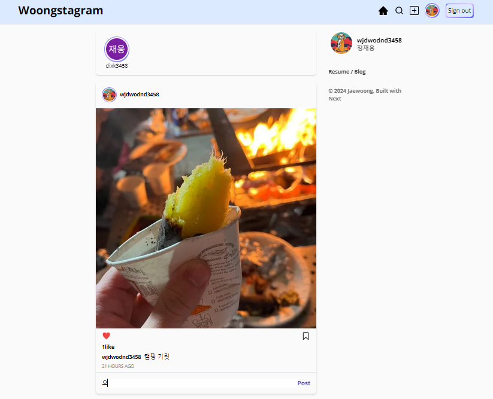
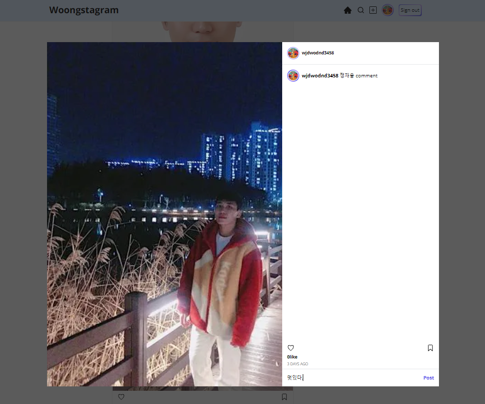
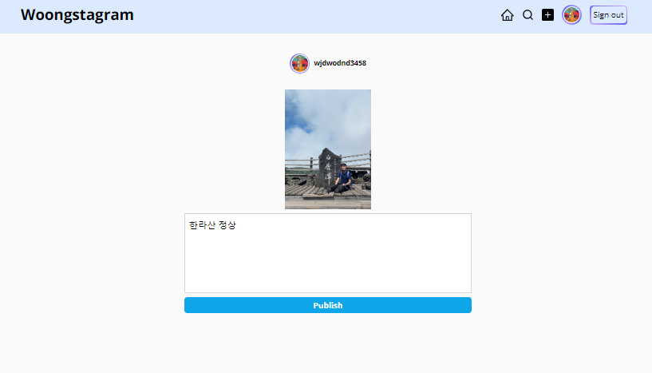
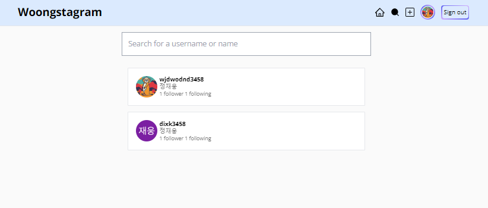

# Woongstagram

---

> **SNS 서비스**   **개발기간 : 2024.02 ~ 2024.03**

#### 배포주소

---

> Web Page : https://woongstagram.vercel.app

### 프로젝트 소개

---

**일상을 공유하고 소통하는 SNS 서비스 입니다.**

웹 페이지는 다음과 같은 기능을 지원합니다.

1. Google계정을 이용한 사용자 로그인
2. 사용자 Following/Follow
3. 새로운 Post 작성
4. Post에 대한 반응(좋아요,Bookmark,Comment)

 

### 시작 가이드

---

#### Requirements

For building and running the application you need:

- Node.js 18.13.0
- Npm 8.19.3
- Yarn 3.2.3

#### Installation

> $ git clone https://github.com/dixk3458/Woongstagram.git   \$ cd Woongstagram

 

### Stacks

---

#### Environment

#### Config

#### Development

 

### 화면 구성📺

    
    
    
    
    

 

### 개발 일지 📕

---

https://www.notion.so/e9a6790edd03473abf5027a50ffde16e?pvs=4
